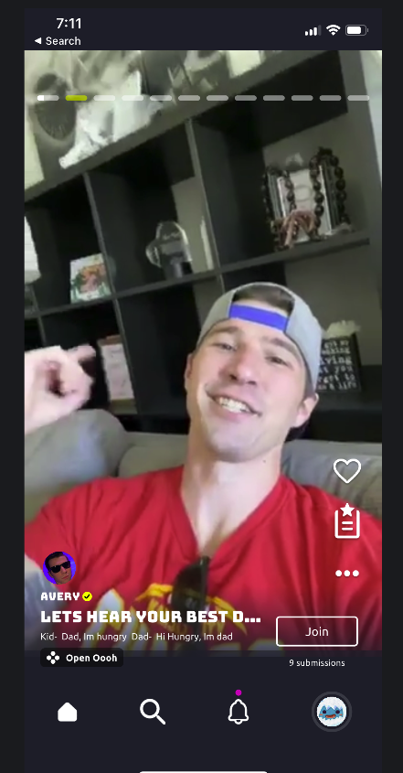
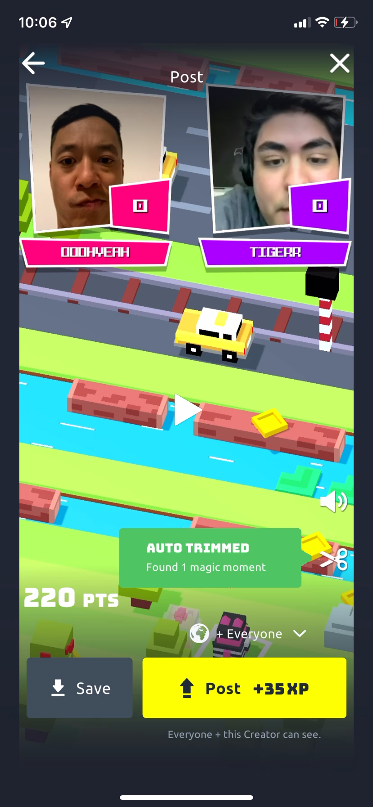
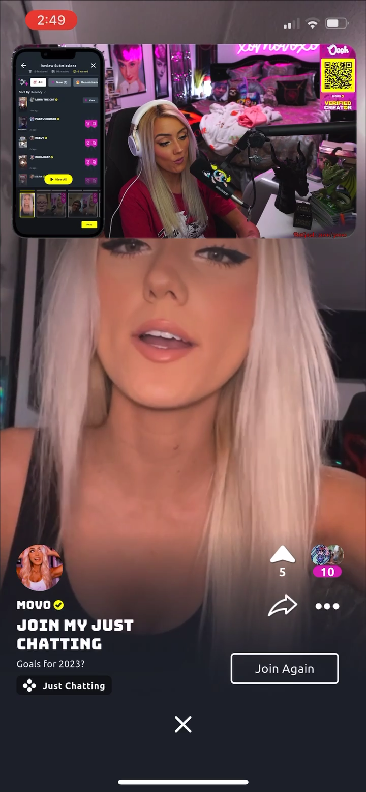
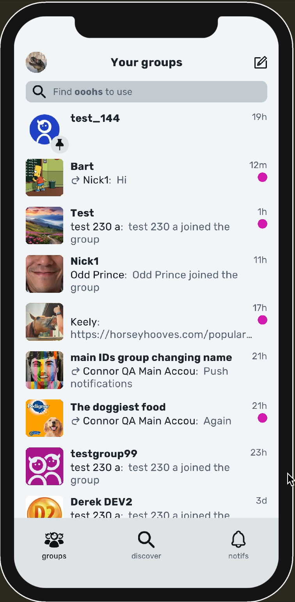
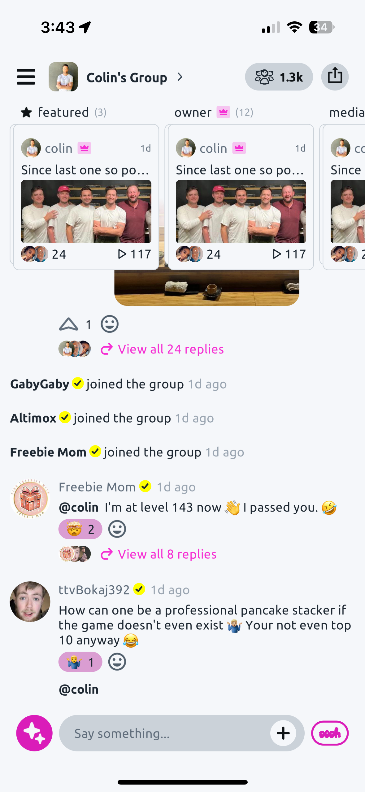
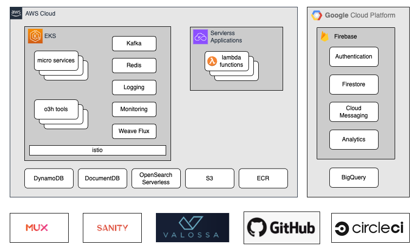
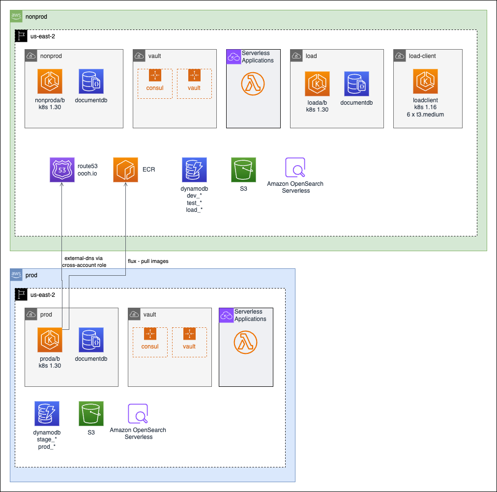
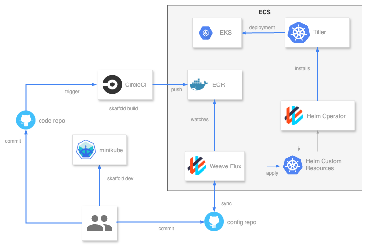
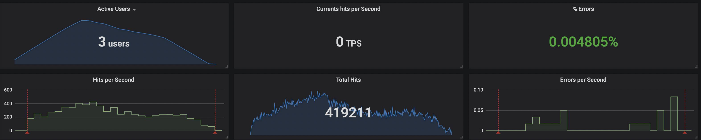
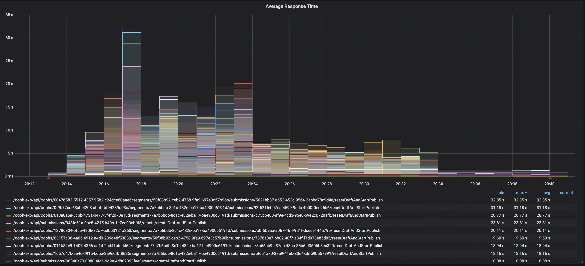

# Overview

When Oooh was founded in 2019, its mission was to create a social platform that encouraged safe, positive engagement for its community of users. 
While the product itself went through many iterations and pivots, the goals of the service architecture that powered it remained largely the same:

  - Cost-effectively scale from a few dozen to millions of users
  - Be flexible enough to accommodate radical pivots in product direction
  - Allow for rapid iteration on features
  - Minimal downtime

Over the course of 5 years, I designed and evolved an architecture that met these goals, and led the team that implemented it. 
This page describes that architecture, its features, and the trade-offs that were made.

### History

To provide some context for why the architecture evolved the way it did, it is useful to review a brief history of the product.

#### 2019-2020: Video Sharing + Games

The first iteration of the product was a video sharing platform with a focus on games. Users could host games or other activities (ie. "ooohs),
and other users could submit responses. The platform also included a catalog of ooohs that users could play, and leaderboards to track their progress.

#### 2021-2022: Streaming + Games

After getting some traction with the streaming community, the product pivoted to focus on streaming and games. Twitch streamers would use Oooh to engage with their audience during the live stream.

#### 2023-2024: Chat + Games

Realizing that chat was a powerful driver for engagement, the product pivoted to focus on group chat. The platform became a group chat app with a focus on games and AI-enhanced features.

# Architecture

Back in 2019, cloud computing had hit its stride and there were lots of providers to choose from. I chose AWS to host the bulk of our storage and compute, mostly because it was well known, and it would give us a bigger pool of talent to draw from as the company scaled up. We also had a lot of AWS startup credits that would give us more room for exploration. However, the Firebase suite of services offered by GCP was well suited to the needs of the mobile application we were building, so I ended up going with a multi-cloud strategy. This multi-cloud architecture is depicted below.

Generally, I tried to keep the architecture cloud-agnostic where possible, so we could switch to a different provider if that became advantageous or necessary. To this end, I chose to use portable technologies like Kubernetes and Istio to manage our services. Kubernetes allowed the architecture to meet the goal of scaling horizontally as needed, and Istio provided a way to manage the complexity of a microservice architecture.

When designing the architecture, I made the conscious decision to use managed databases as we didn't have the expertise or resources to maintain our own instances. This also kept persistent state outside the cluster, which simplified cluster upgrades and failover.  
NoSQL databases were chosen for their flexibility and scalability. I found DynamoDB scaled very well for simple key-value storage, but for more complex queries, such as those needed for our federated GraphQL service, DocumentDB was a better fit. OpenSearch was used as a vector store for embeddings we generated from user content, which we then made use of to implement certain AI features of the platform. Firestore was used for data that needed to be synchronized with the clients in real time, which became an important part of the architecture when the product pivoted to a group chat app.

Serverless applications were a late addition to the architecture. This was to support developers outside the core team who wanted to extend the platform with their own functionality. These extensions could be implemented in either JavaScript or Python, and defined functions that the platform would call when certain actions were taken by the clients. The initial use case for these extensions were AI applications and agents that could interact with the users in novel ways.

Aggregation of service logs was done with Fluent-bit and sent to an OpenSearch instance. Istio and Jaeger added trace information to the logs, which allowed us to trace a request through the entire system. This was extremely helpful when troubleshooting issues in live environments. Prometheus and Grafana were used to monitor the health of the system, and to alert us when things went wrong. Istio was also integrated with Prometheus, making it easy to identify bottlenecks in the system. Micrometer was used by many of the services to report custom metrics that could be monitored in Grafana.

Finally, a number of third-party services were enlisted to handle tasks that were outside the core competencies of the team. For example, Mux excelled at video transcoding and delivery in a cost-effective way. Valossa provided a unique approach to analyzing video content that we could leverage for our moderation and safety features. CircleCI and GitHub Actions are adept at hosting CI/CD pipelines for a variety of platforms at a reasonable cost.

### AWS Architecture

Since the bulk of the architecture was hosted on AWS, its worth going into a bit more detail on that.  
The main AWS components that the platform made use of are depicted below.

In accordance with AWS best practices, the production environment was hosted in a separate account with limited access. Generally, the nonprod and prod accounts had a similar structure, with the addition of some load testing resources in the nonprod account. This separation did add some complexity, however, as some resources are global and needed to be shared between accounts. In particular, the "oooh.io" domain was hosted by Route53 in the nonprod account, but the cert-manager instance in the prod cluster needed to be able to update the DNS records in Route53 so the Lets Encrypt challenge could be completed. Similarly, the CI/CD pipeline deployed images to ECR in the nonprod account, but the prod cluster needed to be able to pull those images when the services were deployed. These complexities necessitated cross-account roles and policies, which were codified in Terraform plans to ensure they were consistent and auditable.

The EKS clusters were set up with an A/B configuration to allow upgrades and other infrastructure changes to be verified before switching traffic over. Typically, the clusters would be upgraded once per year, starting with the load test cluster, which would undergo rigorous testing before migrating the changes to the nonprod cluster. After the development team verified there were no issues introduced by the upgrade, the changes were then applied to the inactive prod cluster where a final set of verification checks were done before switching live traffic over to it. The previously active cluster would be left running for a few days in case any issues arose, upon which traffic would be switched back. Finally, when all environments were stable, the inactive clusters would be shut down, though not destroyed. This allowed us to have the inactive clusters available for disaster recovery within a few minutes, should we have needed that, but put them in a state that incurred minimal cost.

# Services

The heart of the platform was a set of microservices that provided the core functionality of the app. These services were designed to be loosely coupled, so that they could be developed and deployed independently. This allowed the team to iterate quickly on features, and to scale the services independently as needed.  

The services were implemented in a variety of languages, including Java, Python, and Node.js, depending on the needs of the service. Primarily, services were implemented in Java, using the Spring Boot framework. This allowed us to leverage the rich ecosystem of Spring libraries, as well as develop our own set of libraries that could be shared across services.

Most services provided a REST API, but some also provided a GraphQL API, which was implemented using the Netflix DGS framework. The Apollo Router was used to federate GraphQL queries across the various services, and to provide a single schema for the platform's data model. The services were also loosely coupled using a publish/subscribe model based on Spring Cloud Stream and Kafka.

All totaled, the platform consisted of 20 services and 14 libraries contributing to a code base of over 284,000 lines of code. There were over 2100 integration tests that covered 70% of the code.  
The various categories of services the platform provided are described below.

### Account Management

While Firebase provided the authentication and authorization services for the mobile app, there was still a need to manage the user data and preferences that were specific to our platform. This included things like display names, avatars, and various account settings and preferences. The account service provided a REST API that the app and customer support tools could use to manage these settings.

### Chat

When the platform pivoted to a group chat app, the chat service was introduced to manage groups, threads and messages. It provided the REST API that the mobile app used to create and manage groups, and to post messages to these groups. The service also maintained a "view model" of the groups and their chat history in a Firestore database which the client would subscribe to for real-time updates. The chat service also provided the GraphQL API that the app used to query for messages and other chat-related data.

### Content Publishing

The Oooh platform was originally designed to support the sharing a type of multimedia content which we called "ooohs". An oooh could be something as simple as a text or video post, or it could be a complex activity that could include game play logic and state, as well as a variety of media assets needed for that experience. Ooohs proved to be a flexible way to represent a wide variety of content, and that functionality was maintained even as the platform pivoted to a group chat app.

There were a number of steps required to safely and robustly share content on the platform, so a suite of services was developed to implement a publish pipeline. The publish process would start with a request to the content service indicating what assets to publish. This service would then make use of the upload service to get the presigned urls that the client would upload the assets to. When the upload was complete, a service provider like Mux or Sanity would ingest the asset and prepare it for delivery. As each asset associated with the content completed its upload, an asset analysis service would analyze the asset's media and assign it a safety score. A moderation service would wait until all assets associated with the content had been scored, then use the user's reputation and the safety score of each asset to determine if the content could be published. Content that was not automatically approved would be put in a queue for manual review, where it could be approved or rejected by a human moderator using the community support tools.

### Notifications

The Oooh platform supported a variety of ways to notify users of activity on the platform. This included an inbox for each user, in-app "toast" or popup notifications, and push notifications. The notification service subscribed to events from other services, and would then generate the appropriate notifications for the user. Inbox messages and in-app notifications made use of a Firestore database that the client would subscribe to for real-time updates. Push notifications were sent using Firebase Cloud Messaging. The notification service also provided a REST API that the client could use to manage notifications settings, and supported a batching system to aggregate frequent push notifications and limit spam.

### Social

The Oooh platform included a set of services that provided the social features that users expect from a modern social platform. This included the ability to follow other users, like content, and share content outside the platform. The social service provided a REST API that the client could use to manage these relationships, and also provided a GraphQL API that the client could use to query for social data.

### Progression

To encourage user engagement, the platform included a progression system that would track user activity and provide rewards for completing tasks. This allowed us to encourage the type of engagement we wanted to see on the platform. The progression service provided a REST API that the client could use to query for user progress, and also provided a GraphQL API that the client could use to query for progression data. The service also provided an API that product managers could access via the community support tools to tune the progression system.

### Recommendation

The recommendation service provided a way to generate recommendations for users based on their activity on the platform. Initially, the service used a simple algorithm based on activity reported by other services, but was later integrated with Recombee, a third-party service that provided content based and collaboration filtering. This was later replaced with a custom network-based recommendation system that used a matrix of weighted relationships generated from BI data. This provided a more flexible and cost-effective solution that could be tuned to the needs of the platform.  
As generative AI services became more widely available, the service was extended to use embeddings generated from user and group content to find similar users and groups. 

### Monetization

The platform needed a way to generate revenue to support its operations, so a suite of services was developed to support virtual goods and currency.
This included a service to integrate with the various app stores (Google Play and Apple App Store) to handle in-app purchases and mapping those purchases to a virtual currency, a commerce service to manage the exchange of virtual goods, and an inventory service to track the ownership of each user's virtual goods.

A unique aspect of the Oooh platform is that it allowed users to earn real money by creating and selling virtual goods. This required a complex system to track the real value of each virtual coin so that we could accurately calculate the amount to pay out to users who sold their virtual goods. There were also mechanisms in place to handle app store refunds and the implications of those on the virtual economy.

### Platform Extensions

In order to explore the use if generative AI in the platform, a serverless extension system was designed to support developers outside the core team who wanted to extend the platform with their own functionality. This system allowed developers to write custom extensions in either JavaScript or Python and deploy them as serverless applications that could be installed on the platform. We used this extension mechanism to implement features that leveraged various AI APIs to do things like generate summaries of group chat, identify popular threads of conversation, and recommend news articles and other links related to the conversation. This extension system also supported chatbots to answer questions about the platform, provide support, or generally respond to queries from the users, but within the context of the group chat in which they were posted.

### Community Support Tools

The community support tools provided a portal for our team to manage application data, moderate content, and provide support to our users.
The tools were implemented using node.js and react.

# CI/CD Pipeline

When the company formed in 2019, there were a variety of robust CI/CD SaaS offerings available, so I decided it would be best to make use of one of those rather than maintain our own build servers. I chose CircleCI for its integration with GitHub, and the flexibility it offers by containerizing build tools.
I also chose to use a GitOps model for deploying changes to our Kubernetes clusters. This allowed us to manage the cluster configuration in a way that was both versioned and auditable, and allowed for easy rollbacks and disaster recovery. It also simplified deployment security, as we only had to allow a process in the cluster to pull from Git and ECR repos, rather than give the build system full access to the cluster.

The full CI/CD pipeline is depicted below.

As the diagram shows, the pipeline starts with a commit to the GitHub repository. This triggers a build in CircleCI, which runs the integration tests and builds a Docker image. If the build is successful, the image is pushed to the ECR repository. The FluxCD operator in the cluster watches the ECR repository for changes, and for environments where auto deploy is enabled, it updates the HelmRelease resource for the service with the updated image tag which triggers an update to the cluster. For environments where auto deploy is not enabled, such as stage and production, the HelmRelease resource is manually updated with the new image tag by and admin and committed to the Git repo which triggers the update to the cluster. The HelmRelease resource also defines all the values for the service's Helm chart, so updates to the various Kubernetes and Istio configurations, as well as application specific properties, can be applied in the manner and will be fully auditable and reversible.

# Load Testing

To ensure that the platform could handle the expected load in a cost-effective manner, I set up a scalable Kubernetes cluster of JMeter clients that would post requests to the service APIs at volume. Each JMeter instance reported its results to a central InfluxDB server which Grafana would then query to display the results in real time. This allowed us to see how the system behaved under load, and to identify bottlenecks that needed to be addressed.

To ensure that the load tests verified realistic traffic patterns, I would record requests made from the mobile application using Charles Proxy. I would then export those recordings to JMeter test plans and tune them to work with a large pool of users

This setup allowed us to efficiently create and run load tests on a regular basis, typically every couple of sprints.

# Acknowledgements

While I'm proud of the architecture I designed, I'm even prouder of the talented team that helped bring it to life.
They are a diverse group of individuals with a wide range of skills and backgrounds, but all came together to build something truly special.

- [Tim Cham](https://www.linkedin.com/in/timothy-cham/) - Backend Engineer
- [Simon Roscoe](https://www.linkedin.com/in/simon-roscoe/) - Full Stack Engineer
- [Wuilbert Jaramillo](https://www.linkedin.com/in/wuilbert-jaramillo-175190b/) - Server Engineer
- [Jay Shanks](https://www.linkedin.com/in/jay-shanks-6027aa9/) - DevOps Engineer
- [Danielle Tilley](https://www.linkedin.com/in/danielle-tilley/) - Tools Engineer
- [Calham Northway](https://www.linkedin.com/in/calham-northway-643890158/) - Tools Engineer
